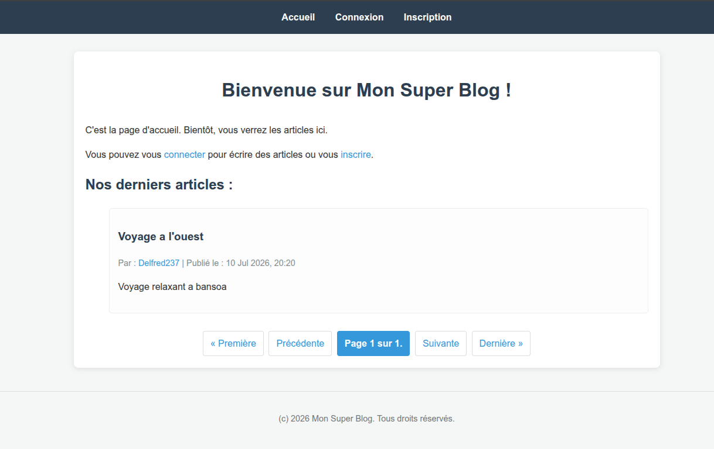
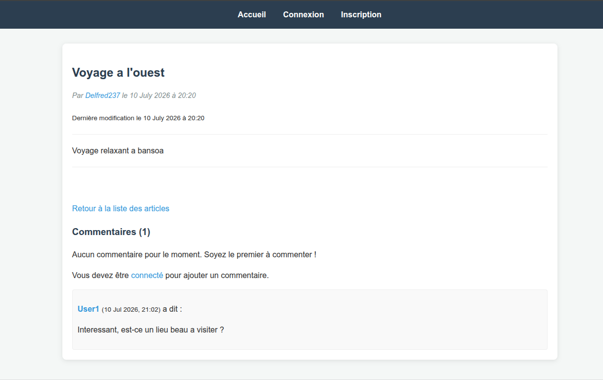
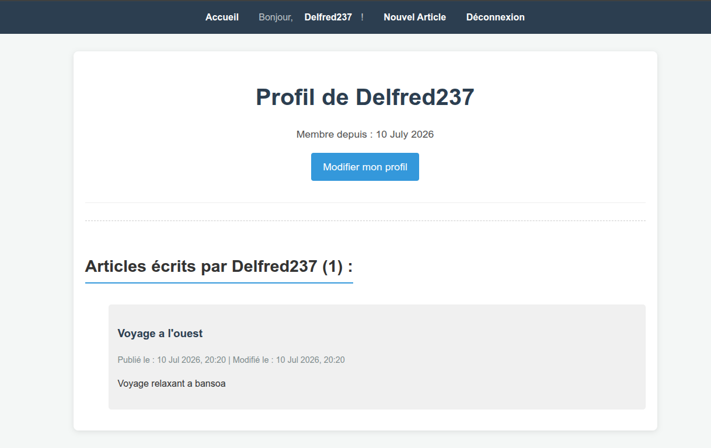

# Django Blog

A simple and clean blog application built with Django that allows users to publish articles, manage comments, and interact with blog content.

This project demonstrates Django fundamentals including authentication, CRUD operations, pagination, database management, and Docker containerization.

---

## Features

### Authentication

- User registration
- User login
- User logout
- User profile page

### Articles Management

- Create articles
- View articles
- Update articles
- Delete articles
- Article pagination

### Comments Management

- Add comments to articles
- Update comments
- Delete comments

### Other

- Clean interface
- SQLite database
- Dockerized development environment

---

## Tech Stack

### Backend

- Python
- Django

### Database

- SQLite

### Frontend

- HTML
- CSS

### DevOps

- Docker
- Docker Compose

---

# Installation

## Option 1: Run locally

### Clone the repository

```bash
git clone https://github.com/your-username/django-blog.git

cd django-blog
```

### Create a virtual environment

```bash
python -m venv venv
```

Activate it:

### Windows

```bash
venv\Scripts\activate
```

### Linux / macOS

```bash
source venv/bin/activate
```

### Install dependencies

```bash
pip install -r requirements.txt
```

### Configure environment variables

Create a `.env` file based on `.env.example`.

Example:

```env
SECRET_KEY=your-secret-key
DEBUG=True
```

### Apply database migrations

```bash
python manage.py migrate
```

### Create an administrator account (optional)

```bash
python manage.py createsuperuser
```

### Start the development server

```bash
python manage.py runserver
```

Application available at:

```
http://127.0.0.1:8000/
```

---

# Option 2: Run with Docker

### Build and start the container

```bash
docker compose up --build
```

Or run in background:

```bash
docker compose up -d
```

The application will automatically:

- Install dependencies
- Apply database migrations
- Start the Django server

Access the application:

```
http://127.0.0.1:8000/
```

### Stop the container

```bash
docker compose down
```

---

# Screenshots

## Home Page



## Article Details



## User Profile



---

# Project Structure

```
django-blog/

│── blogapp/
│   ├── migrations/
│   ├── templates/
│   ├── static/
│
│── django_blog/
│
│── screenshots/
│
│── Dockerfile
│── docker-compose.yml
│── entrypoint.sh
│── .dockerignore
│── .gitignore
│── .env.example
│── requirements.txt
│── README.md
│── manage.py
```

---

# Future Improvements

- Article search functionality
- Categories and tags
- Like system
- User avatars
- Rich text editor
- REST API
- Image upload support
- Deployment with Gunicorn and Nginx

---

# Author

**Tene Fossi Delfred**

Full Stack Developer  
Java • Spring Boot • React • Django • Docker

LinkedIn:  
https://www.linkedin.com/in/delfred-fossi-a39b43240/